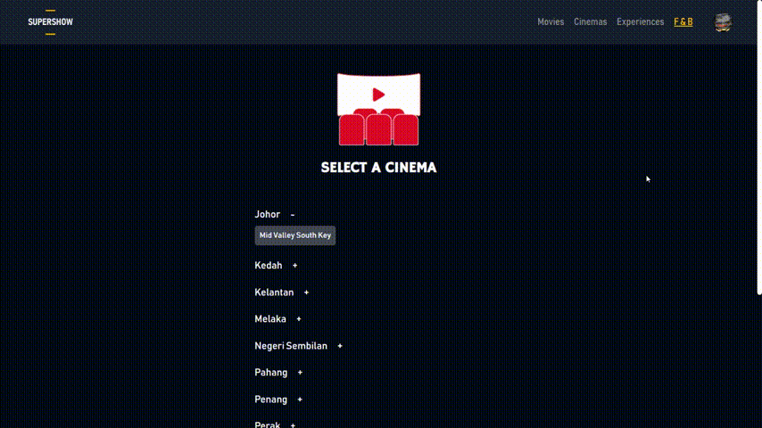
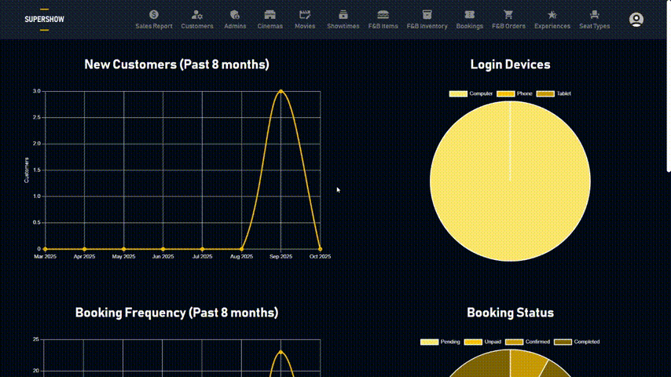

# 🎬 Cinema Ticketing System
A web-based system that allows users to browse movies, select seats, place F&B orders, and make bookings easily.  
It also provides an admin interface to manage movies, showtimes, seats, and food menus.

## 🖥️ Preview

### 🏠 Home Page
Shows currently available movies and showtimes.

### 🎟️ Ticket Booking
Browse movies, choose a showtime, select seats, and confirm your booking.

### 🍿 F&B Ordering
Order snacks and drinks along with your movie ticket.

### ⚙️ Admin Management
Manage movies, showtimes, seat layouts, and F&B items.

---

## 🚀 Features

### 🎟 User Features
- Browse current and upcoming movies
- View movie details, ratings, and showtimes
- Select seats and confirm ticket bookings
- Order food and beverages
- View booking confirmation or information

### 🧑‍💼 Admin Features
- Add, edit, or remove movies and showtimes
- Manage seat layouts for each hall
- Manage F&B menus and prices  
- View, update, and cancel bookings
- Sales report